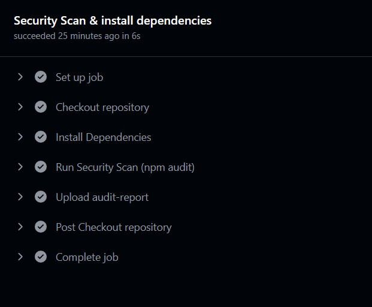

# Harridee E-commerce App (Harridee Marketplace) - Work In Progress

This project, developed by **Dzissah Donatus Dziedzorm** for **Jomacs IT**, details the design and deployment of the **Harridee E-commerce App (Harridee Marketplace)**.  You've done so well for yourself. Great work, Donatus! Cheers, Johnson!!

## Project Question

**Secure CI/CD Pipeline with Automated Scanning**

**Overview:**

*   Implement a simple application (Node.js, Python, or Go) and set up a CI/CD pipeline that includes automated security scanning steps.
*   Demonstrate how the pipeline enforces security checks before code gets deployed.

**Steps:**

1.  Create a small web application:
    *   A minimal RESTful API or a static site is enough.
2.  Set up version control and CI/CD:
    *   Use GitHub Actions, GitLab CI, or Jenkins.
3.  Include security scanning:
    *   Static Application Security Testing (SAST): e.g., Snyk, Bandit for Python, or `npm audit` for Node.js.
    *   Dependency Scanning: Ensure libraries have no known CVEs.
4.  Add secrets management best practices:
    *   Store credentials in GitHub Secrets, Vault, or AWS Secrets Manager instead of environment variables in the repo.
5.  Generate compliance-related artifacts:
    *   Pipeline logs, vulnerability scan reports, etc.

## Technologies and resources Used

*   AWS EC2 
*   Application LLoad Balancer (ALB)
*   Route 53
*   AWS Web Application Firewall (WAF)
*   Terraform
*   Node.js
*   GitHub Actions (CI/CD)
*   Security Tools (npm audit)
*   Dependabot
*   Infrastructure as Code (IaC) using Terraform

## Setup Instructions

1.  Clone the repository:

    ```bash
    git clone [https://github.com/getdzidon/jomacs-q1.git](https://github.com/getdzidon/jomacs-q1.git)
    cd jomacs-q1
    ```

The app was deployed adhering to **SOC2** regulations.

Feel free to connect on LinkedIn or reach out if you have any questions or enhancements for this project.

## Architecture Diagram


## Application Link

[https://market.harridee.com/](https://market.harridee.com/)


# Mapping Features and Controls to Meet SOC2 Standards

## CI/CD Pipeline Configuration

The CI/CD workflow automates building, vulnerability scanning, and deployment of the application to an AWS EC2 instance.


### Dependency Installation and Security Scanning

The pipeline uses Node.js, installs libraries, and runs vulnerability checks (`npm audit`) on every code push.




**Control Alignment with SOC2:** CC701, CC7.2

## Artifact Storage and Logging

*   **Description:** (Add description here)
*   **Control Alignment with SOC2:** (Add SOC2 control alignment here)

## Controlled Deployment / Release Management

*   **Description:** (Add description here)


*   **Control Alignment with SOC2:**
    *   **Change Management:** This confirms that all changes are authorized, tested, and validated before a new release. **Ref: CC8.1**
    *   **System Operations:** Automated checks reduce and prevent human error, providing consistent security enforcement. **Ref: CC7.2**

## Use of GitHub Secrets

*   **Description:** Secrets such as EC2 SSH keys, host DNS, user credentials, access keys, and IDs are stored in GitHub Secrets to be retrieved in the pipeline, rather than being hardcoded in the workflow.


*   **Control Alignment with SOC2:**
    *   **Logical Access Controls:** Ensures credentials and sensitive information are confidential and their access is properly restricted. **Ref: CC6.1 - CC6.3**
    *   **Encryption and Key Management:** Data at rest in GitHub Secrets is protected using encryption. **Ref: CC6.6**

## Automating Updates Using Dependabot

**Dependabot** is configured to automatically create pull requests for new versions of npm, GitHub Actions, and Terraform dependencies. This ensures the project stays current with security patches and feature updates.

